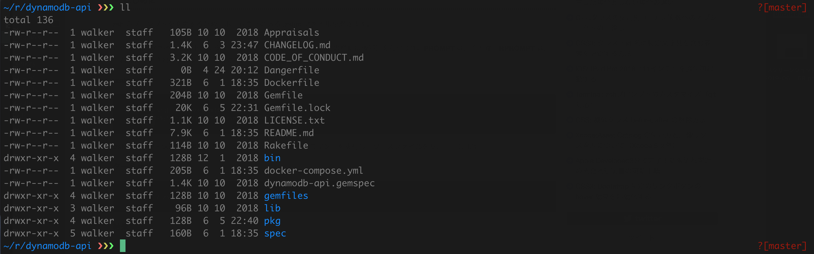

# Darkhack-iTerm2

## Installation
+ Download the file called __darkhack.itermcolors__.
+ Open iTerm2, go to Preferences, then Profiles. Create a new one if you want
+ Then, click on the "Colors" tab, and click on "Color Presets", at the bottom.
+ Select "Import..." and choose __darkhack.itermcolors__.

# Screenshots

